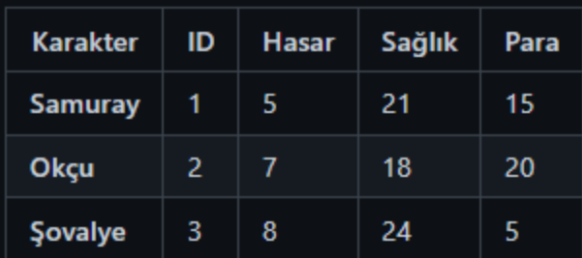
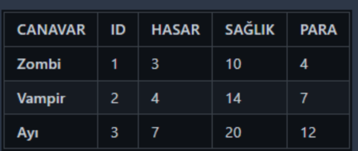
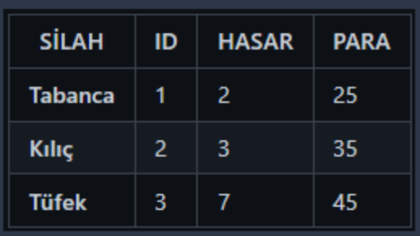

# Macera Oyunu

Bu proje, basit bir Java tabanlı bir oyunu içerir. Oyuncuların farklı bölgelerde düşmanlarla savaşarak ödüller kazandığı ve karakterlerini geliştirdiği bir macera oyunudur.

## Oyunun Amacı
Bu metin tabanlı macera oyununda, oyuncular çeşitli bölgelerde canavarlarla savaşarak ödüller toplar. Oyuncunun amacı, tüm bölgelerdeki ödülleri toplayarak Güvenli Ev'e dönmektir. Oyuncu, savaş bölgelerindeki tüm düşmanları yendikten sonra bölgeye özel ödülü envanterine ekler. Tüm ödülleri topladıktan sonra Güvenli Ev'e dönen oyuncu oyunu kazanır. Ödül kazanılan bölgeye tekrar giriş yapılamaz.

### Karakterler

### Canavarlar

### Silahlar

### Zırhlar

## Mekanlar

- Güvenli Ev
    - Özellik: Can Yenileniyor

- Mağara
    - Canavar: Zombi (1-3 Adet)
    - Özellik: Savaş + Ganimet
    - Eşya: Yemek (Food)

- Orman
    - Canavar: Vampir (1-3 Adet)
    - Özellik: Savaş + Ganimet
    - Eşya: Odun (Firewood)

- Nehir
    - Canavar: Ayı (1-3 Adet)
    - Özellik: Savaş + Ganimet
    - Eşya: Su (Water)

- Mağaza
    - Özellik: Destekleyici Eşyalar Satın Almak
    - Silahlar: Tabanca, Kılıç, Tüfek
    - Zırhlar: Hafif, Orta, Ağır

- Maden (Yeni Bölge)
    - Canavar: Yılan (1-5 Adet)
    - Özellik: Savaş ve Ganimet
    - Eşya: Para, Silah veya Zırh

## Oyunun Kuralları

- Oyunu bitirebilmek için savaş bölgelerindeki tüm düşmanlar temizlendikten sonra bölgeye özel ödül oyuncunun envanterine eklenmelidir.
- Eğer oyuncu tüm ödülleri toplayıp "Güvenli Eve" dönebilirse oyunu kazanır.
- Ayrıca ödül kazanılan bölgeye tekrar giriş yapılamaz.
- Yeni bir savaş bölgesi eklenmelidir. Bu bölgenin amacı yenilen rakiplerden rastgele para, silah veya zırh kazanma ihtimali olmasıdır.

## Bölge Ödülleri

- Mağara: Yemek (Food)
- Orman: Odun (Firewood)
- Nehir: Su (Water)
- Maden: Rastgele (Silah,Zırh,Para) veya hiçbir şey gelmeme

## Nasıl Oynanır

1. Oyuna başlamak için bir karakter seçin.
2. Farklı bölgelerdeki düşmanlarla savaşın.
3. Düşmanları yendikten sonra ödüller kazanın.
4. Kazanılan ödülleri envanterinize ekleyin ve karakterinizi geliştirin.
5. Oyuncunun sağlık puanı sıfıra düşerse oyunu kaybedersiniz.
6. Tüm ödülleri toplayıp Güvenli Eve dönerek oyunu kazanın

Başarılar!

